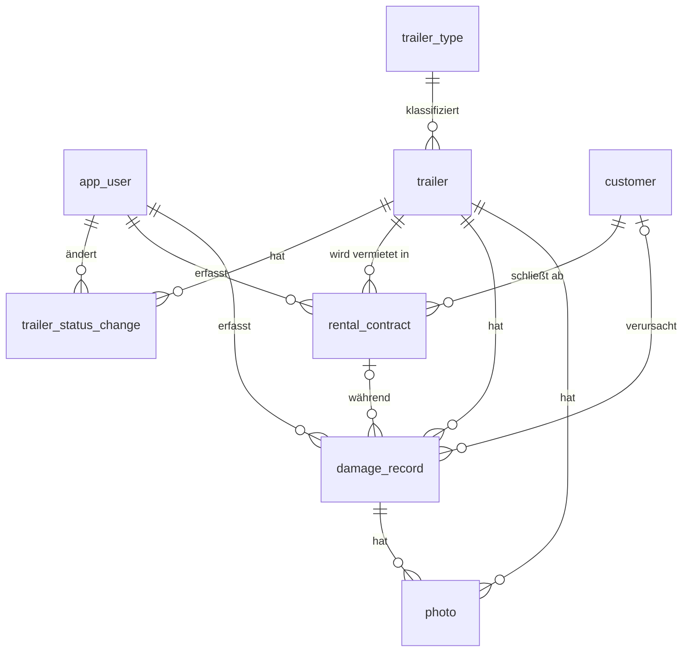

# Datenbankmodell

> Status: Entwurf zur Abstimmung im Team
> Datum: 08.10.2026
> Grundlage: Anforderungsdokument Kap. 7, `REQUIREMENTS_REVIEW.md`, `ADR-002-admin-scope-and-users.md`
> Unabhängig von der Zugriffstechnologie (Drift oder sqflite). Das Schema gilt für beide.

---

## 1. Grundregeln

| Thema | Regel |
|---|---|
| Datenbank | Eine SQLite-Datei `app.sqlite` im App-Datenordner (`database/`) |
| Fremdschlüssel | `PRAGMA foreign_keys = ON` bei jeder Verbindung (in SQLite standardmäßig aus) |
| Namen | Tabellen und Spalten Englisch, `snake_case`, Tabellen im Singular |
| Primärschlüssel | `id INTEGER PRIMARY KEY` (automatisch fortlaufend) |
| Zeitpunkte | `TEXT` im ISO-8601-Format in UTC, z. B. `2026-10-08T14:30:00Z` |
| Datumswerte ohne Uhrzeit | `TEXT` im Format `YYYY-MM-DD` |
| Geldbeträge | `INTEGER` in Cent. `1.234,50 Euro` wird als `123450` gespeichert. Keine Gleitkommazahlen für Geld |
| Enums | `TEXT` mit `CHECK`-Constraint. Gespeichert wird der englische Name des Dart-Enums (`available`, nicht `Verfügbar`). Die Anzeige kommt aus `AppStrings` |
| Pflichtfelder | `NOT NULL`. Optional nur, wo ausdrücklich angegeben |
| Zeitstempel | Jede fachliche Tabelle hat `created_at` und `updated_at` |
| Archivieren | `archived_at` (NULL = aktiv). Gilt für `trailer` und `customer` |
| Schema-Version | `PRAGMA user_version`. Startwert 1, jede Migration erhöht um 1 |

---

## 2. Übersicht



| Tabelle | Zweck |
|---|---|
| `app_user` | Mitarbeiter, die die Anwendung bedienen |
| `trailer_type` | Feste Liste der Anhängertypen |
| `trailer` | Anhänger mit aktuellem Status und Standort |
| `trailer_status_change` | Protokoll jeder Statusänderung |
| `customer` | Kunden |
| `rental_contract` | Mietverträge |
| `damage_record` | Schäden, Unfälle, Ereignisse |
| `photo` | Fotos zu Anhängern oder Schäden |

---

## 3. Tabellen

### 3.1 `app_user`

| Spalte | Typ | Pflicht | Regel |
|---|---|---|---|
| id | INTEGER | ja | PK |
| name | TEXT | ja | UNIQUE |
| is_active | INTEGER | ja | 0 oder 1, Standard 1 |
| created_at | TEXT | ja | |
| updated_at | TEXT | ja | |

### 3.2 `trailer_type`

| Spalte | Typ | Pflicht | Regel |
|---|---|---|---|
| id | INTEGER | ja | PK |
| name | TEXT | ja | UNIQUE, z. B. „Pkw-Anhänger“, „Tieflader“ |
| created_at | TEXT | ja | |
| updated_at | TEXT | ja | |

Eigene Tabelle statt Freitext, damit „beliebteste Typen“ im Dashboard sauber gezählt werden. Typen werden in den Einstellungen gepflegt.

### 3.3 `trailer`

| Spalte | Typ | Pflicht | Regel |
|---|---|---|---|
| id | INTEGER | ja | PK |
| internal_code | TEXT | ja | UNIQUE, interner Bezeichner, z. B. `A-017` |
| license_plate | TEXT | ja | UNIQUE |
| trailer_type_id | INTEGER | ja | FK → `trailer_type.id` |
| status | TEXT | ja | `available`, `rented`, `maintenance`, `blocked` |
| location_address | TEXT | nein | Freitext-Adresse |
| location_latitude | REAL | nein | −90 bis 90 |
| location_longitude | REAL | nein | −180 bis 180 |
| location_updated_at | TEXT | nein | |
| archived_at | TEXT | nein | |
| created_at | TEXT | ja | |
| updated_at | TEXT | ja | |

### 3.4 `trailer_status_change`

| Spalte | Typ | Pflicht | Regel |
|---|---|---|---|
| id | INTEGER | ja | PK |
| trailer_id | INTEGER | ja | FK → `trailer.id` |
| old_status | TEXT | nein | NULL beim Anlegen des Anhängers |
| new_status | TEXT | ja | wie `trailer.status` |
| changed_at | TEXT | ja | |
| changed_by_user_id | INTEGER | ja | FK → `app_user.id` |
| rental_contract_id | INTEGER | nein | FK → `rental_contract.id`, gesetzt bei automatischer Änderung durch Übergabe/Rückgabe |

Nur Einfügen, nie Ändern oder Löschen. Jede Änderung an `trailer.status` schreibt in derselben Transaktion einen Eintrag.

### 3.5 `customer`

| Spalte | Typ | Pflicht | Regel |
|---|---|---|---|
| id | INTEGER | ja | PK |
| first_name | TEXT | ja | |
| last_name | TEXT | ja | |
| email | TEXT | ja | Format wird im Application Layer geprüft |
| phone | TEXT | ja | |
| street | TEXT | ja | Straße und Hausnummer |
| postal_code | TEXT | ja | TEXT wegen führender Nullen |
| city | TEXT | ja | |
| license_number | TEXT | nein | Führerscheinnummer |
| archived_at | TEXT | nein | |
| created_at | TEXT | ja | |
| updated_at | TEXT | ja | |

### 3.6 `rental_contract`

| Spalte | Typ | Pflicht | Regel |
|---|---|---|---|
| id | INTEGER | ja | PK |
| customer_id | INTEGER | ja | FK → `customer.id` |
| trailer_id | INTEGER | ja | FK → `trailer.id` |
| start_at | TEXT | ja | Mietbeginn |
| end_at | TEXT | ja | `CHECK (end_at > start_at)` |
| pickup_location | TEXT | ja | |
| return_location | TEXT | ja | |
| price_cents | INTEGER | ja | `CHECK (price_cents >= 0)` |
| status | TEXT | ja | `planned`, `active`, `completed`, `cancelled` |
| handed_over_at | TEXT | nein | tatsächliche Übergabe |
| returned_at | TEXT | nein | tatsächliche Rückgabe |
| created_by_user_id | INTEGER | ja | FK → `app_user.id` |
| created_at | TEXT | ja | |
| updated_at | TEXT | ja | |

Fachregeln aus ADR-002 §2.4, umgesetzt im Application Layer innerhalb einer Transaktion:

- Keine Überschneidung: Für denselben `trailer_id` darf es keinen anderen Vertrag mit Status `planned` oder `active` geben, für den `start_at < neues end_at` und `end_at > neues start_at` gilt.
- Bearbeiten nur im Status `planned`.
- Übergabe (`planned` → `active`) setzt `handed_over_at`, Anhänger auf `rented` und schreibt `trailer_status_change`.
- Rückgabe (`active` → `completed`) setzt `returned_at`, Anhänger auf `available` und schreibt `trailer_status_change`.
- Stornieren nur aus `planned`.

### 3.7 `damage_record`

| Spalte | Typ | Pflicht | Regel |
|---|---|---|---|
| id | INTEGER | ja | PK |
| trailer_id | INTEGER | ja | FK → `trailer.id` |
| event_date | TEXT | ja | `YYYY-MM-DD` |
| description | TEXT | ja | |
| damage_type | TEXT | ja | `accident`, `vandalism`, `wear`, `other` |
| caused_by | TEXT | ja | `customer`, `internal`, `unknown` |
| customer_id | INTEGER | nein | FK → `customer.id`, nur sinnvoll bei `caused_by = customer` |
| rental_contract_id | INTEGER | nein | FK → `rental_contract.id` |
| cost_cents | INTEGER | nein | `CHECK (cost_cents IS NULL OR cost_cents >= 0)` |
| created_by_user_id | INTEGER | ja | FK → `app_user.id` |
| created_at | TEXT | ja | |
| updated_at | TEXT | ja | |

### 3.8 `photo`

| Spalte | Typ | Pflicht | Regel |
|---|---|---|---|
| id | INTEGER | ja | PK |
| trailer_id | INTEGER | nein | FK → `trailer.id` |
| damage_record_id | INTEGER | nein | FK → `damage_record.id`, `ON DELETE CASCADE` |
| file_path | TEXT | ja | relativ zum App-Datenordner, UNIQUE |
| sort_order | INTEGER | ja | Standard 0, Reihenfolge der Anzeige |
| created_at | TEXT | ja | |

`CHECK ((trailer_id IS NULL) <> (damage_record_id IS NULL))`: Ein Foto gehört genau zu einem Anhänger oder genau zu einem Schaden.

---

## 4. Löschregeln

| Tabelle | Verhalten |
|---|---|
| `trailer`, `customer` | Nicht löschen, nur archivieren (`archived_at`) |
| `rental_contract` | Nicht löschen, nur stornieren |
| `trailer_status_change` | Nie ändern oder löschen |
| `app_user` | Nicht löschen, nur `is_active = 0` |
| `trailer_type` | Löschen nur, wenn kein Anhänger darauf verweist (`ON DELETE RESTRICT`) |
| `damage_record` | Löschen erlaubt. Zugehörige `photo`-Zeilen werden per Cascade gelöscht, die Bilddateien löscht der Application Layer |
| `photo` | Löschen erlaubt, Datei wird mit entfernt |

Alle anderen Fremdschlüssel: `ON DELETE RESTRICT` (Standardverhalten bei aktivierten Fremdschlüsseln).

---

## 5. Indizes

| Index | Zweck |
|---|---|
| `trailer(status)` | Filter nach Status, Dashboard-Zählung |
| `trailer_status_change(trailer_id, changed_at)` | Statushistorie eines Anhängers |
| `rental_contract(trailer_id, start_at)` | Überschneidungsprüfung, Vertragsliste je Anhänger |
| `rental_contract(customer_id)` | Vertragshistorie eines Kunden |
| `rental_contract(status, start_at)` | Dashboard: Vermietungen pro Monat, offene Verträge |
| `damage_record(trailer_id, event_date)` | Chronologische Schadenshistorie |
| `photo(trailer_id)`, `photo(damage_record_id)` | Fotos zu einem Datensatz laden |

UNIQUE-Spalten (`internal_code`, `license_plate`, `name`, `file_path`) sind automatisch indiziert.

---

## 6. Fotos und App-Datenordner

```text
<App-Datenordner>/
├── database/
│   └── app.sqlite
└── images/
    ├── trailers/<trailer_id>/<dateiname>
    └── damages/<damage_record_id>/<dateiname>
```

- In der Datenbank steht nur der relative Pfad, z. B. `images/trailers/12/1728390000123.jpg`. Dadurch funktioniert ein Backup auch auf einem anderen Rechner.
- Beim Hochladen wird die Datei in den App-Datenordner kopiert, nicht nur verlinkt.
- Dateinamen werden von der Anwendung erzeugt (z. B. Zeitstempel in Millisekunden), nie vom Benutzer übernommen.

---

## 7. Startdaten

Bei der ersten Erstellung der Datenbank:

- ein Benutzer „Administrator“
- Anhängertypen: Pkw-Anhänger, Kastenanhänger, Planenanhänger, Tieflader, Autotransporter

---

## 8. Offene Punkte

| Punkt | Wo klären |
|---|---|
| Zugriffstechnologie Drift oder sqflite | ADR-003 |
| Berechnung der Dashboard-Kennzahlen | `REQUIREMENTS_REVIEW.md` R2 |
| Backup-Format und Import-Verhalten | `REQUIREMENTS_REVIEW.md` R3 |
| Ermittlung des App-Datenordners (z. B. `path_provider`, neue Dependency) | zusammen mit ADR-003 |
